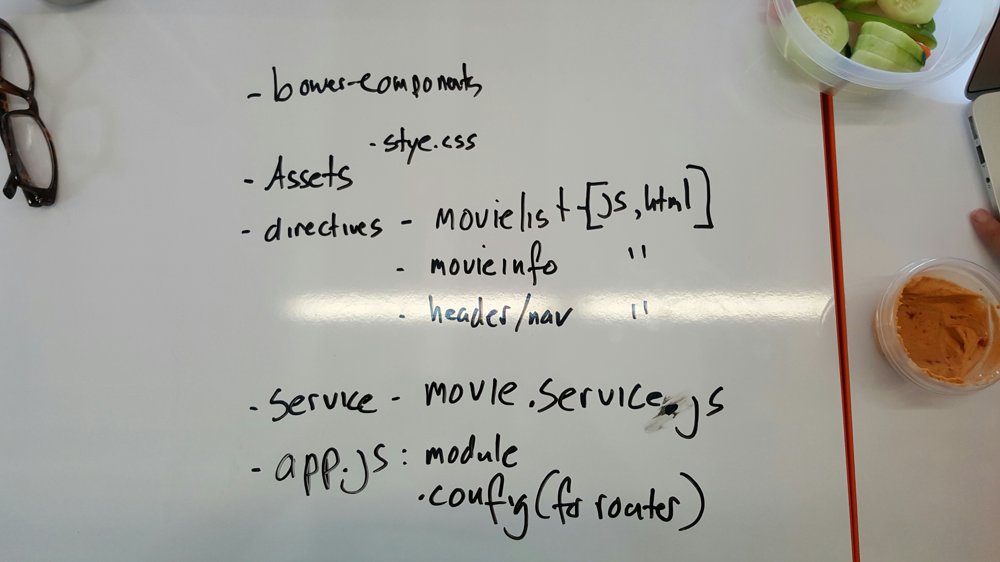

### IMDB project with AngularJS
##### Explanation is needed:
This is in master branch, because we forgot to branch at the right point.
We had  different way to do it- which is now in vision1 branch.

